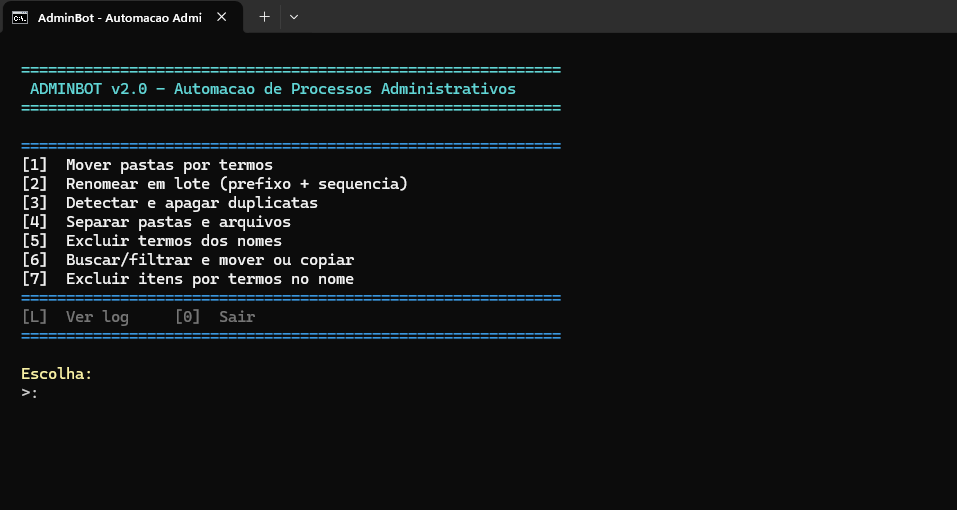

 
# Software Automação de Processos 

Este projeto demonstra como automatizar tarefas repetitivas utilizando scripts e ferramentas de linha de comando manipulação pastas e docs escrito em python e PowerShell.  
A automação ajuda a aumentar a produtividade, reduzir erros e simplificar fluxos de trabalho.

## Ilustração

## Funcionalidades
- Gestão e manipulação de pastas e documentos
- Execução de rotinas automatizadas
- Integração com Python para maior flexibilidade

## Como usar
1. Clone este repositório
2. Instale as dependências necessárias
3. Execute os scripts de automação pela linha de comando
